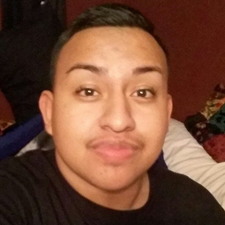

They were military veterans and kindergarten teachers.

Sons. Brothers. Sisters. Mothers.

They were enjoying a country music concert when bullets rained down – a horrific shooting that killed at least 59 people and injured 500 more.

These are the victims of the [Las Vegas shooting](http://www.nydailynews.com/tags/las-vegas-shooting) who have been identified so far.
^^^^^^
## The Victims

### Denise Cohen
Cohen’s son, Jeff Rees remembered his mother as a “strong, beautiful and happy woman who made a difference to lives of everyone she knew.” He told California television station KEYT her last photo showed her and boyfriend Derrick “Bo” Taylor, who was also killed in the mass shooting. Cohen, from Carpinteria, Calif., worked as a property manager in Santa Barbara and was recently working to become a more active member of her church.

### Derrick “Bo” Taylor 
The 56-year-old lawman from Oxnard, Calif., logged nearly three decades working in California and Nevada, most recently watching over firefighting inmates at the Ventura Conservation Center, according to KCRA-TV. “There are no words to express the feeling of loss and sadness regarding Bo’s passing,” said Joel Martinez, his former Sierra Conservation Center warden. Taylor was killed alongside his girlfriend, Denise Cohen, during their Sin City getaway. He leaves behind two adult sons.

### Calla Medig
The Canada native took time off from her restaurant job at Moxie’s in west Edmonton to make the trip to Vegas, her boss, Scott Collingwood told the Canadian Free Press – the third year in a row she attended the festival. Coworkers described Medig as a “super bright and amazing person.” “She was a little bit of everything around here, she was kind of a rock, and as of Thursday she would have been our newest manager,” Collingwood said. “A lot of us around here have super heavy hearts and we already miss her.”

### Tara Roe
Roe, 34, worked as a model with Sophia Models International for nearly 10 years. In a statement, the Calgary-based agency recalled her “friendly face and caring spirit.” The mother of two, who was living in Okotoks in Alberta, also worked as an educational assistant with the Foot Hills School Division in High River. Roe’s family confirmed she was among the dead late Monday, according to Global News.

### Chris Hazencomb
The 44-year-old sports junkie from Camarillo, Calif., was shot in the head while shielding his friend’s wife from the bullets raining down from the 32nd floor of a Las Vegas hotel and casino. “He was good to everybody. He’d go out on a limb for everybody,” his mother, Maryanne Hazencomb told the Ventura County Star. She agreed to disconnect her son’s ventilator just before 11 a.m. Monday morning. With a priest by her side, Maryanne said goodbye to her music-loving son.

### Patricia Mestas
Mestas, a 64-year-old living in San Antonio, was a mother and a dedicated Christian who loved country music. One of her favorite artists was Jason Aldean, who was performing when the gunfire began. “She went to almost every country show within driving distance,” her best friend, Isa Bahu told the Orange County Register. “She was an amazing woman. She was a good person. She had a great heart.” Her cousin Tom Smith described her as “a role model.” “She just shined,” he told the Press Enterprise.

### Nicol Kimura
Kimura, 38, attended the concert with a group of friends, including Ryan Miller. “Our close knit group of seven was in attendance together at Route 91, up from Orange County, California,” Miller said. “We scattered after the shooting began and were reunited, less one, many hours later.” In a GoFundMe set up for a memorial fund in her name, Miller recalled her “infectious laugh” and “how much she loved life.”

### Carly Kreibaum
The mother of two and Iowa native was separated from friends after she was struck by a bullet amid the shooting, the Sioux City Journal reported. Her husband Chris on Tuesday wrote in a Facebook post that he was headed to Las Vegas to search for her, but a family member confirmed her death to KITV later the same day. Kreibaum studied art in college and had worked at a Wal-Mart in Spencer, Iowa for the last few years.

### Carrie Parsons
Parsons, of Seattle, loved country music. Eric Church was her favorite singer. She was able to see him perform at the Festival on Friday. “It’s the only language the whole world speaks in one way or another,” her friend Robbie Walden told Q13 Fox. “She loved music. She loved country music.” Colby Rezayat said he penned a letter to senators when he learned of his high school friend’s death. “It felt like something tangible I could do to begin this grieving process of the loss of a wonderful childhood friend to such an abhorrent act of violence,” he wrote in a Facebook post.

### Austin Davis
Davis, 29, attended Sunday's concert with friends and family from his hometown of Riverside, Nevada. He worked as a pipefitter for UA Local 364 in Las Vegas, according to the LA Times. His girlfriend, Aubree Hennigan, last spoke with him two hours before the bloodshed began. “He just told me that Big & Rich was playing and he didn’t really care for them but they threw one hell of a concert,” she said. “That’s all he told me.” Hennigan spent many painful hours searching for answers about Davis during the aftermath, before learning he had perished.

### Brennan Stewart
Born and raised in the City of Lights, Stewart’s passion for country music extended well beyond the music on his iPod. “He was extremely caring, driven by his love for his family, friends and music. He followed his passion of playing guitar and writing his own music,” his best friend’s fiance, Stacie Leporati, 27, told the Daily News. “He brightened every room he walked into with his smile, laugh, and mini wine bottles for everyone. His personality was enormous.” The Las Vegas man, who was killed at just 30 years old, was with his girlfriend, Gia, at the concert on Sunday. She was not injured.

### Melissa Ramirez
Ramirez, a California State University graduate, worked as a customer service representative in Lancaster, Calif., not far from where she grew up in Littlerock. Friends of the 26-year-old described her as a “genuine” and “bubbly” young woman with a passion for people — and the Philadelphia Eagles. “She was an amazing friend and brought so much joy anywhere she went,” said her friend Kim Rosales, 25, who was with Ramirez at the concert. Ramirez is survived by her mother and father, her older brother, her younger sister, and her niece.

### Heather Alvarado
Alvarado, the wife of 35-year-old Cedar City, Utah, firefighter Albert Alvarado, decided to take her family to the concert to “get away,” according to a GoFundMe set up for medical and funeral expenses. “Heather is the first to help out and she is always welcoming.” She died late Monday night at a Las Vegas Hospital, the Salt Lake Tribune reported.

### Stacee Rodrigues Etcheber
Etchebar had worked for more than 20 years as a hairstylist, most recently at Ciao Bella Hair Salon in Novato, the San Francisco Chronicle reported. The 50-year-old mother of two was attending the concert with her husband of 20 years, Vinnie Etcheber, who is a member of the San Francisco police force.

### Lisa Patterson
"Lisa had an infectious energy and fierce love for her family,” according to a GoFundMe set up to raise money for a memorial fund.
Patterson, a mother of three, dedicated much of her time to the Palos Verde Girls Softball league, often volunteering alongside her husband of 30 years. “I can't believe she's gone,” he said.

### Christina Duarte
The 21-year-old University of Arizona graduate was first reported missing in the chaotic aftermath of the festival shooting, but family members confirmed she was among the victims Tuesday afternoon. The Torrance, Calif., woman had been at the concert with her brother's girlfriend, who was injured in the deadly incident, according to the Daily Breeze.

### Rocio Guillen Rocha
Loved ones remembered the mother as “young beautiful, happy” and “hard-working.” The Anaheim resident was a longtime cast member at Disneyland is survived by her children, ages 18, 13, 16 months and 1 month as well as her fiance, according to a GoFundMe page. 
"Her greatest accomplishment was being a mother, as she would always say. She was a supermom."

### BRIAN FRASER 
In the last minutes of his life, Brian Fraser worked his way toward the front of the Las Vegas stage.
The California man wanted a good spot to hear his favorite musician, country star Jason Aldean, play his favorite tune “Dirt Road Anthem.” He never got the chance. “A bigger than life man taken far too soon,” read a GoFundMe page to raise funds for Fraser’s wife Stephanie and their four children. “His family was his world.”

### Dorene Anderson 
Anderson, a fan of the Alaska Aces minor league hockey team and stay-at-home mother, was attending the concert with her daughters when gunfire broke out, KTUU reported. The 49-year-old Anchorage resident was listed among the victims in an email to employees at her husband's workplace, Alaska Finance Corp. Her friend Gayle Simmons described her as a “beautiful, kind and giving woman.”

### Bill Wolfe
Wolfe's Pennsylvania community is “brokenhearted” and already feeling his loss, Shippensburg police said in a Facebook post, which confirmed his passing. He coached Little League and was listed as the head coach for students in kindergarten through 6th grade at Shippensburg Greyhound Wrestling, NBC Philadelphia reported. Wolfe attended the country music festival with his wife Robyn, who was not injured.

### Michael Anderson
Anderson “was everything a woman could want,” his girlfriend Biana Acosta wrote in a social media post confirming he was among the dead. Anderson had a 2-year-old son along with a 6-month-old boy with Acosta, according to a GoFundMe page set up to cover his funeral expenses. “I have been crazy in love with this man since I was 15,” she wrote. “He was our whole world. And now I don't know how to go on without him.”

### Kurt Von Tillow
Von Tillow, a 55-year-old Cameron Park, Calif., resident, was surrounded by family members when the gunshots rang out. His sister and niece were hospitalized following the shooting and his wife, daughter, and son-in-law managed to escape unharmed, KCRA reported. “My brother-in-law was the most patriotic person you ever met,” Mark Carson told the news station. “Guarantee you, he was covered in red, white and blue, with a Coors Light in his hand, smiling with his family.”

###Victor Link
The 52-year-old loan processor, who was born and raised in Shafter before moving to San Clemente, Calif., was a music lover and spent the last several months traveling to different concerts with his fiancé Lynn Gonzalez, Bakersfield.com reported.
Link was killed in the gunfire and Gonzalez was treated for shock at the hospital.
He also leaves behind a 23-year-old son, whom he adopted.

### Sonny Melton
Melton, 29, was a registered nurse who lived in western Tennessee. He was at the concert with his wife, Heather, to celebrate their one-year wedding anniversary. “He saved my life. He grabbed me and started running when I felt him get shot in the back,” his wife told Fox affiliate KVVU. “I want everyone to know what a kind-hearted, loving man he was, but at this point, I can barely breathe.”

### Charleston Hartfield
Hartfield, 34, was a Las Vegas police officer who previously served in the military. He’d posted a photo of the concert just hours before he was fatally shot. A relative told the Daily News on Monday that Hartfield had two young children, and friends said he coached a youth football team.

### Adrian Murfitt
Murfitt was a 35-year-old commercial fisherman who lived in Anchorage, Alaska. He was standing near the stage when a bullet pierced his neck. “He was always happy. He was always there for his friends,” best friend Brian MacKinnon, who attended the concert with Murfitt, told the Alaska Dispatch News.

### Lisa Romero-Muniz
Romero-Muniz had worked at Miyamura High School in Gallup, N.M., since 2003, school officials said. Students and faculty held a vigil for her Monday night to remember the longtime secretary. “As many of our students have mentioned in some of their Facebook posts and to many of us that she was there for them and she respected them and tried to work with them as much as she could,” said Mike Hyatt, Gallup-McKinley County School District interim superintendent.

### Rachael Parker
Parker, 33, was a 10-year veteran of the Manhattan Beach Police Department in California, where she was a records technician. Two other civilian employees and an officer, who was wounded, were with her. “She was close to a lot of people,” Manhattan Beach Police Capt. Tim Hageman told the News. “She would laugh, and you knew it was Rachael laughing, even if you couldn’t see her.”

### Denise Burditus
Burditus, of Matinsburg, W.Va., was at the three-day festival with her husband Tony. The high school sweethearts both shared photos during the concert. “It saddens me to say that I lost my wife of 32 years, a mother of two, soon to be grandmother of five this evening in the Las Vegas shooting,” her grieving husband wrote on Facebook. “Denise passed in my arms. I LOVE YOU BABE.”

### Cameron Robinson
Robinson was shot in the neck while attending the concert with his boyfriend. 
The 28-year-old St. George, Utah, resident commuted to his job for the City of Las Vegas, his sister told the Las Vegas Review-Journal. He was a legal records specialist. 

### Jordan McIldoon
McIldoon, 23, was a mechanic apprentice in Maple Ridge, British Columbia, and at the concert with his girlfriend.
They got split up amid the gunfire. McIldoon died in the arms of Heather Gooze, a bartender at the festival. She got in touch with McIldoon’s girlfriend and broke the news. She also promised McIldoon’s mother she’d stay with him, and she did for almost six hours.

### Jenny Parks
Parks was a married mother of two who taught kindergarten in Lancaster County, Calif. “She touched many lives,” reads a GoFundMe page for her family. “Her life was cut far too short on the last night of the Route 91 Harvest Festival.”

### Jessica Klymchuk 
Klymchuk was a mother of four who lived in Valleyview, Alberta, according to CBC. She worked at a Catholic school where staff and students broke down Monday when they learned the devastating news. 

### Sandy Casey
Casey, 35, was a teacher in Manhattan Beach, Calif., and was part of a staff trip to the Route 91 Harvest festival, the Daily Breeze reported. “She has made a tremendous difference in the lives of her students and their families, many of whom worked with her over multiple years,” the district said in a statement. She became engaged to her boyfriend, Christopher Willemse, in April. They worked together at the school and shared a love of country music. 

### Angela Gomez
Gomez was described as “a cheerful young lady with a warm heart and loving spirit,” according to a GoFundMe page set up for her family. She graduated from Riverside Poly High School in southern California two years ago, where the school said she was an active member of the community. 

### Susan Smith
Smith, 53, lived and worked in Simi Valley, Calif. She was married and had two adult children. She worked as an officer manager throughout the Simi Valley Unified School District since 2001, according to the Ventura County Star. “She was wonderful. She had a great sense of humor. She's patient and kind,” district spokesman Jake Finch told the newspaper. “She’s the hub ... really the heart of the school.”

### Quinton Robbins
Robbins, a 20- year-old recreational assistant for Henderson, Nev., was an avid fisherman and snowboarder, the Las-Vegas Review-Journal reported. His younger sister, Skylar recalled the times they took to the slopes together and described his final moments on Twitter. “Laying next to you in the hospital bed all night was the hardest thing I've gone through but you made me feel so at peace I know you are with me,” she wrote.

### Neysa Tonks
Tonks’ brother, AJ Yerage, remembered her as someone who was “always laughing, always joking” and “always sarcastic.” The 45-year-old mother of three sold software for the southern California-based technology company, Tehnologent, KUTV reported. She was born and raised in Salt Lake City area before she moved to Las Vegas 10 years ago. “How happy and lucky I feel that she was part of my life,” Yerage said. “I can hear her laugh, her voice in my head and my heart right now.”

### Rhonda LeRocque
Rhonda LeRocque of Tewksbury, Mass., was the mother of a 6-year-old girl and a devout Jehovah’s Witness.  She was among the crowd at the Sunday night finale of a three-day country music festival when killed by one of the bullets that left 59 fellow music lovers dead. She is survived by her husband Jason and their daughter. Rhonda “was a great example of what a wife, mother, sister, daughter and niece should be, and touched so many lives,” her family said on GoFundMe.

### Jack Beaton
The Bakersfield, Calif., resident was shot as he shielded his wife Laurie from gunfire and later died at the hospital, KBAK reported. They were at the concert celebrating their 23rd wedding anniversary, which was on Oct. 1. “He never passed up an opportunity to give somebody a hand,” his father-in-law, Jerry Cook, said. “Everybody that came in contact with him loved the guy.” 

### Bailey Schweitzer
The 20-year-old country music fan was a receptionist at Infinity communications and Consulting in Bakersfield Calif., Bakersfield.com reported. Her colleagues on Monday left a lone candle at her desk as tribute and remembered her as a “ray of sunshine in our office on a cloudy day.” “No one could possibly have a bad day when Bailey was around,” her co-workers said in statement. “There will never be a replacement for her in our hearts.”

### Dana Gardner
Gardner worked for San Bernardino County for more than 26 years, most recently as a deputy recorder, the San Bernardino Sun reported. Her employer described the 52-year-old as a “go-to” person and a “dedicated public servant.” Five other county employees were injured while attending Sunday's concert in a “non-official capacity.”

### John Phippen
The Santa Clarita father – along with his son, a recent graduate from Valencia High School – were among those shot in Sunday's deadly incident in Las Vegas, the Signal reported. While the son was shot in the arm and remains hospitalized, Phippen, who ran a remodeling and repair company in Valencia, was reportedly shot in the back and died early Monday morning.
”He had a heart that was larger than life and personality to match,” his friend Leah Nagyivanyi said.

### Thomas Day Jr.
The 54-year-old father worked as a home builder in Riverside, the L.A. Times reported. He attended the Route 91 Harvest Festival with his four children — all of them in their 20s and 30s.
Day's children are now all with his father, Thomas Day Sr., who struggled to put words together amid the tragedy.
”He was the best dad,” he said. “That's why the kids were with him.”

### Hannah Ahlers
Ahlers, 34, was attending the festival on the Las Vegas strip with her husband of 16 years as well as three other couples, according to the Las Vegas Review-Journal. She had three children, ages 3, 11, and 14, and her father-in-law described her as a “loving caring and devoted mother.” “She could have lit the world up with her smile,” he said.

### Chris Roybal
He knew the sound of automatic gunfire from combat. That harrowing but familiar sound returned at the country musical festival. The 28-year-old Navy veteran was at the concert with his mother, celebrating his return from Afghanistan, when they were separated by the hail of bullets. “Nobody would let me go back in, they were pulling me away,” his grieving mom, Debby Allen, said. “I kept screaming, ‘My son! My son,’” she told the Daily News.

### Jennifer Irvine
Irvine, a 42-year-old attorney from Las Vegas, was “holding hands with her girlfriends singing and dancing to country music when she was shot in the head,” her longtime friend, Kyle Kraska, wrote on Facebook. Kraska, sports director for CBS News 8, continued on to describe her as “a shining light that will not be extinguished by a gutless coward with a gun.”

### Carrie Barnette
Walt Disney Company Chairman and CEO Bob Iger sent out a company-wide email to break the news that 34-year-old Barnette was killed at the Route 91 Harvest Festival. She worked with Disney's culinary team for 10 years, most recently at Flo's V8 Café in Cars Land at Disney California Adventure Park. Her cousin, Janice Chambers, told the Arizona Republic that Barnette was the “life of the party” and remembered her “beautiful soul.”

### Laura Shipp
Shipp, 50, was attending the festival with her boyfriend and her son Corey, a Marine reservist.
As the shots rang out, they were all separated. Corey tried desperately to find his missing mother through Facebook, only to later learn she was among the casualties. The longtime resident of Thousand Oaks, Calif., moved to Las Vegas in recent years.

### Kelsey Meadows
The 28-year-old was a substitute teacher at Taft Union High School in California, where she had a “sweet spirit and a love for children,” principal Mary Alice Finn wrote in a statement to KERO-TV. Meadows’ devastated brother Brad confirmed her death on Facebook. “It is with an absolutely shattered heart that I let everyone know that Kelsey did not survive this tragic event,” he wrote. 

### Jordyn Rivera
Tomás Morales, president of California State University, broke the news in a somber note to students that “tragedy has against shaken our nation,” and that a peer was among the victims. Morales personally knew Rivera, 21, from a 2016 summer abroad program in London. “We will remember and treasure her for her warmth, optimism, energy, and kindness,” he wrote. The fourth-year student was studying healthcare management at the San Bernardino campus.

### Michelle Vo
It was kismet that Kody Robertson met Vo, 32, the night of the concert. The two bonded over beer, golf and she even showed off a tattoo of a flower on her back, Robertson told the Washington Post. After Vo was shot in the chest, Robertson carried her out of the concert grounds. She did not wake up, even as he desperately cried her name.

### Erick Silva
Silva, a 21-year-old Las Vegan, was working security near the stage at the Jason Aldean concert when gunfire erupted. He was trying to help people flee the festival when he was shot, his manager Gino Argento, of Contemporary Services Corporation, told the Las Vegas Review Journal. Silva’s sister Daisy Hernandez held a memorial for her slain brother on Tuesday, while others mourned the loss of his “really funny” personality.

### Andrea Castilla
Castilla’s  boyfriend was preparing to propose to her, her sister said. The 28-year-old Sephora worker from Huntington Beach, Calif., was visiting her sister Athena in Las Vegas for her birthday, and her friends and family flagged down a car to take her to the hospital after she was hit in the head, according to a GoFundMe page. Athena Castilla told the Las Vegas Review Journal that her sister wanted to use her makeup talents to help cancer patients. “I will cry my self to sleep i will weep at night till the morning comes for you my sweet angel Andrea,” her father Gus Castilla posted on Facebook.

### Keri Galvan
Galvan, a 31-year-old mother of three, was visiting Las Vegas from Thousand Oaks, Calif., with her husband. She worked as a server at a local steakhouse, according to the Thousand Oaks Acorn, though her sister said that “her days started and ended with doing everything in her power to be a wonderful mother.” A GoFundMe page was created for her children, ages 10, 4 and 2.

### Steven Berger
Steve Berger, a financial adviser from Shorewood, Minn., was celebrating his birthday in Las Vegas. The divorced father of three, who turned 44 one day before he died, was remembered as a basketball star in high school who won a scholarship to attend St. Olaf College. Josh Decker, his college roommate and co-worker at EFS Financial who was at the concert when shots broke out, said, “He was charismatic, full of energy and breathed life into every room. He was always so positive. He was larger than life to me.”

### Candice Bowers
Candice Bowers, from Garden Grove, Calif., was a restaurant waitress who devoted her life to taking care of her children and those around her. The 40-year-old single mother legally adopted her 2-year-old niece in May, and leaves behind two older children, ages 20 and 16, the Orange County Register reported. Her grandmother Patricia Zacker said Bowers seemed to be turning a corner after a life of hardship and lamented her untimely death, saying, “She never had any support, except herself.”