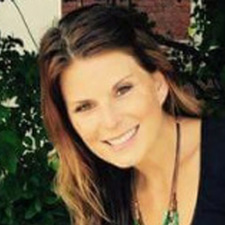
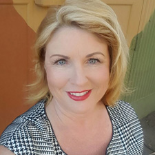

They were military veterans and kindergarten teachers.

Sons. Brothers. Sisters. Mothers.

They were enjoying a country music concert when bullets rained down – a horrific shooting that killed at least 59 people and injured 500 more.

These are the victims of the Las Vegas shooting who have been identified so far.
^^^^^^
## The Victims

### BRIAN FRASER 
In the last minutes of his life, Brian Fraser worked his way toward the front of the Las Vegas stage.
The California man wanted a good spot to hear his favorite musician, country star Jason Aldean, play his favorite tune “Dirt Road Anthem.” He never got the chance. “A bigger than life man taken far too soon,” read a GoFundMe page to raise funds for Fraser’s wife Stephanie and their four children. “His family was his world.”

### Dorene Anderson 
Anderson, a fan of the Alaska Aces minor league hockey team and stay-at-home mother, was attending the concert with her daughters when gunfire broke out, KTUU reported. The 49-year-old Anchorage resident was listed among the victims in an email to employees at her husband's workplace, Alaska Finance Corp. Her friend Gayle Simmons described her as a “beautiful, kind and giving woman.”
”She loved her husband and girls with a passion we could never match,” she wrote. “I admired her every action.”

### Bill Wolfe
Wolfe's Pennsylvania community is “brokenhearted” and already feeling his loss, Shippensburg police said in a Facebook post, which confirmed his passing. He coached Little League and was listed as the head coach for students in kindergarten through 6th grade at Shippensburg Greyhound Wrestling, NBC Philadelphia reported. Wolfe attended the country music festival with his wife Robyn, who was not injured.

### Michael Anderson
Anderson “was everything a woman could want,” his girlfriend Biana Acosta wrote in a social media post confirming he was among the dead. Anderson had a 2-year-old son along with a 6-month-old boy with Acosta, according to a GoFundMe page set up to cover his funeral expenses. “The thing about my love story with Michael is that it has been ever lasting since the moment we locked eyes. I have been crazy in love with this man since I was 15,” she wrote. “He was our whole world. And now I don't know how to go on without him.”

### Kurt Von Tillow
Von Tillow, a 55-year-old Cameron Park, Calif., resident, was surrounded by family members when the gunshots rang out. His sister and niece were hospitalized following the shooting and his wife, daughter, and son-in-law managed to escape unharmed, KCRA reported. “My brother-in-law was the most patriotic person you ever met,” Mark Carson told the news station. “Guarantee you, he was covered in red, white and blue, with a Coors Light in his hand, smiling with his family and listening to some music.”

###Victor Link
The 52-year-old loan processor, who was born and raised in Shafter before moving to San Clemente, Calif., was a music lover and spent the last several months traveling to different concerts with his fiancé Lynn Gonzalez, Bakersfield.com reported.
Link was killed in the gunfire and Gonzalez was treated for shock at the hospital.
He also leaves behind a 23-year-old son, whom he adopted.

### Sonny Melton
Melton, 29, was a registered nurse who lived in western Tennessee. He was at the concert with his wife, Heather, to celebrate their one-year wedding anniversary. “He saved my life. He grabbed me and started running when I felt him get shot in the back,” his wife told Fox affiliate KVVU. “I want everyone to know what a kind-hearted, loving man he was, but at this point, I can barely breathe.”

### Charleston Hartfield
Hartfield, 34, was a Las Vegas police officer who previously served in the military. He’d posted a photo of the concert just hours before he was fatally shot. A relative told the Daily News on Monday that Hartfield had two young children, and friends said he coached a youth football team.

### Adrian Murfitt
Murfitt was a 35-year-old commercial fisherman who lived in Anchorage, Alaska. He was standing near the stage when a bullet pierced his neck. “He was always happy. He was always there for his friends,” best friend Brian MacKinnon, who attended the concert with Murfitt, told the Alaska Dispatch News.

### Lisa Romero-Muniz
Romero-Muniz had worked at Miyamura High School in Gallup, N.M., since 2003, school officials said. Students and faculty held a vigil for her Monday night to remember the longtime secretary. “As many of our students have mentioned in some of their Facebook posts and to many of us that she was there for them and she respected them and tried to work with them as much as she could,” Mike Hyatt, Gallup-McKinley County School District interim superintendent, said at a news conference.

### Rachael Parker
Parker, 33, was a 10-year veteran of the Manhattan Beach Police Department in California, where she was a records technician. Two other civilian employees and an officer, who was wounded, were with her. “She was close to a lot of people,” Manhattan Beach Police Capt. Tim Hageman told the News. “She would laugh, and you knew it was Rachael laughing, even if you couldn’t see her.”

### Denise Burditus
Burditus, of Matinsburg, W.Va., was at the three-day festival with her husband Tony. The high school sweethearts both shared photos during the concert. “It saddens me to say that I lost my wife of 32 years, a mother of two, soon to be grandmother of five this evening in the Las Vegas shooting,” her grieving husband wrote on Facebook. “Denise passed in my arms. I LOVE YOU BABE.”

### Cameron Robinson
Robinson was shot in the neck while attending the concert with his boyfriend. 
The 28-year-old St. George, Utah, resident commuted to his job for the City of Las Vegas, his sister told the Las Vegas Review-Journal. He was a legal records specialist. 

### Jordan McIldoon
McIldoon, 23, was a mechanic apprentice in Maple Ridge, British Columbia, and at the concert with his girlfriend.
The boyfriend and girlfriend got split up amid the gunfire. McIldoon died in the arms of Heather Gooze, a bartender at the festival. The bartender got in touch with McIldoon’s girlfriend nearby and broke the news. She also promised McIldoon’s mother she’d stay with him, and she did for almost six hours. “I wouldn't want anybody to leave,” Gooze told CBC. “You know, I couldn't just leave him by himself.”

### Jenny Parks
Parks was a married mother of two who taught kindergarten in Lancaster County, Calif. “She touched many lives,” reads a GoFundMe page for her family. “Her life was cut far too short on the last night of the Route 91 Harvest Festival.”

### Jessica Klymchuk 
Klymchuk was a mother of four who lived in Valleyview, Alberta, according to CBC. She worked at a Catholic school where staff and students broke down Monday when they learned the devastating news. 

### Sandy Casey
Casey, 35, was a teacher in Manhattan Beach, Calif., and was part of a staff trip to the Route 91 Harvest festival, the Daily Breeze reported. “She has made a tremendous difference in the lives of her students and their families, many of whom worked with her over multiple years,” the district said in a statement. She became engaged to her boyfriend, Christopher Willemse, in April. They worked together at the school and shared a love of country music. 

### Angela Gomez
Gomez was described as “a cheerful young lady with a warm heart and loving spirit,” according to a GoFundMe page set up for her family. She graduated from Riverside Poly High School in southern California two years ago, where the school said she was an active member of the community. 

### Susan Smith
Smith, 53, lived and worked in Simi Valley, Calif. She was married and had two adult children. She worked as an officer manager throughout the Simi Valley Unified School District since 2001, according to the Ventura County Star. “She was wonderful. She had a great sense of humor. She's patient and kind,” district spokesman Jake Finch told the newspaper. “She’s the hub ... really the heart of the school.”

### Quinton Robbins
Robbins, a 20- year-old recreational assistant for Henderson, Nev., was an avid fisherman and snowboarder, the Las-Vegas Review-Journal reported. His younger sister, Skylar recalled the times they took to the slopes together and described his final moments on Twitter. “Laying next to you in the hospital bed all night was the hardest thing I've gone through but you made me feel so at peace I know you are with me,” she wrote. “I was smiling through tears saying goodbye to you for the last time because I know you would be saying 'smell ya later' with your little smirk.”

### Neysa Tonks
Tonks’ brother, AJ Yerage, remembered her as someone who was “always laughing, always joking” and “always sarcastic.” The 45-year-old mother of three sold software for the southern California-based technology company, Tehnologent, KUTV reported. She was born and raised in Salt Lake City area before she moved to Las Vegas 10 years ago. “How happy and lucky I feel that she was part of my life,” Yerage said. “I can hear her laugh, her voice in my head and my heart right now.”

### Rhonda LeRocque
Rhonda LeRocque of Tewksbury, Mass., was the mother of a 6-year-old girl and a devout Jehovah’s Witness.  She was among the crowd at the Sunday night finale of a three-day country music festival when killed by one of the bullets that left 59 fellow music lovers dead.
She was survived by her husband Jason and their daughter, leaving behind a large and distraught group of family members and friends. Rhonda “was a great example of what a wife, mother, sister, daughter and niece should be, and touched so many lives,” her family said on GoFundMe.  “She loved her family with all her heart.”

### Jack Beaton
The Bakersfield, Calif., resident was shot as he shielded his wife Laurie from gunfire and later died at the hospital, KBAK reported. They were at the concert celebrating their 23rd wedding anniversary, which was on Oct. 1. “He never passed up an opportunity to give somebody a hand,” his father-in-law, Jerry Cook, said. “Everybody that came in contact with him loved the guy.” 

### Bailey Schweitzer
The 20-year-old country music fan was a receptionist at Infinity communications and Consulting in Bakersfield Calif., Bakersfield.com reported. Her colleagues on Monday left a lone candle at her desk as tribute and remembered her as a “ray of sunshine in our office on a cloudy day.” “No one could possibly have a bad day when Bailey was around,” her co-workers said in statement. “There will never be a replacement for her in our hearts.”

### Dana Gardner
Gardner worked for San Bernardino County for more than 26 years, most recently as a deputy recorder, the San Bernardino Sun reported. Her employer described the 52-year-old as a “go-to” person and a “dedicated public servant.” Five other county employees were injured while attending Sunday's concert in a “non-official capacity.”

### John Phippen
The Santa Clarita father – along with his son, a recent graduate from Valencia High School – were among those shot in Sunday's deadly incident in Las Vegas, the Signal reported. While the son was shot in the arm and remains hospitalized, Phippen, who ran a remodeling and repair company in Valencia, was reportedly shot in the back and died early Monday morning.
”He had a heart that was larger than life and personality to match,” his friend Leah Nagyivanyi said.

### Thomas Day Jr.
The 54-year-old father worked as a home builder in Riverside, the L.A. Times reported. He attended the Route 91 Harvest Festival with his four children — all of them in their 20s and 30s.
Day's children are now all with his father, Thomas Day Sr., who struggled to put words together amid the tragedy.
”He was the best dad,” he said. “That's why the kids were with him.”

### Hannah Ahlers
Ahlers, 34, was attending the festival on the Las Vegas strip with her husband of 16 years as well as three other couples, according to the Las Vegas Review-Journal. She had three children, ages 3, 11, and 14, and her father-in-law described her as a “loving caring and devoted mother.” “She could have lit the world up with her smile,” he said.

### Chris Roybal
The 28-year-old Navy veteran recently returned from Afghanistan and was reportedly at the concert with his mother, celebrating his upcoming 29th birthday. The pair was separated when the concertgoers were showered with bullets. “He went to combat and came back without being injured, and then goes to a concert and dies,” his mother told NBC4. In one of his final Facebook posts, Roybal discussed what it was like being shot at in combat: “It was never fear, to be honest, mass confusion. Sensory overload followed by an unnatural amount of adrenaline that could never be duplicated through a needle. I was excited, angry and manic.”

### Jennifer Irvine
Irvine, a 42-year-old attorney from Las Vegas, was “holding hands with her girlfriends singing and dancing to country music when she was shot in the head,” her longtime friend, Kyle Kraska, wrote on Facebook. Kraska, sports director for CBS News 8, continued on to describe her as “a shining light that will not be extinguished by a gutless coward with a gun.”

### Carrie Barnette
Walt Disney Company Chairman and CEO Bob Iger sent out a company-wide email to break the news that 34-year-old Barnette was killed at the Route 91 Harvest Festival. She worked with Disney's culinary team for 10 years, most recently at Flo's V8 Café in Cars Land at Disney California Adventure Park. Her cousin, Janice Chambers, told the Arizona Republic that Barnette was the “life of the party” and remembered her “beautiful soul.”